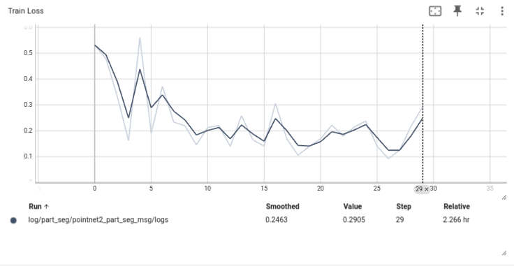
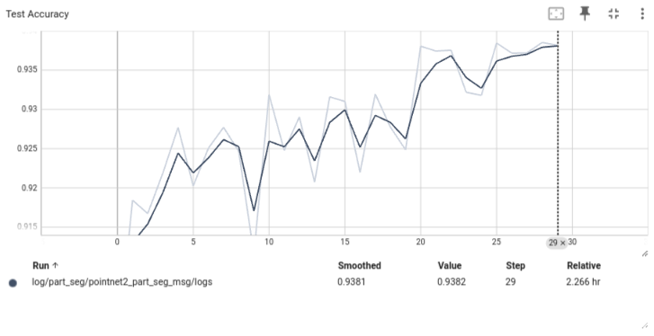
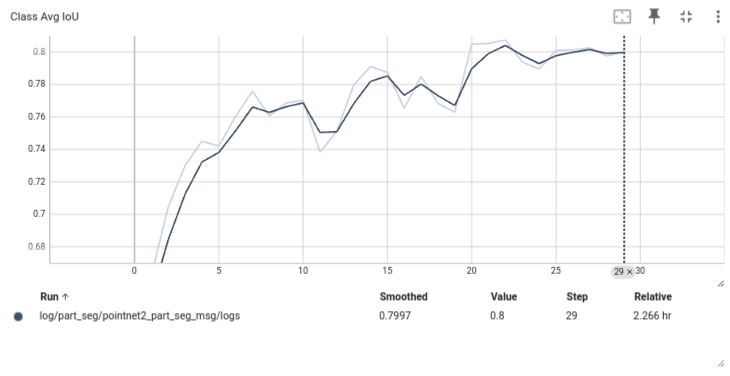
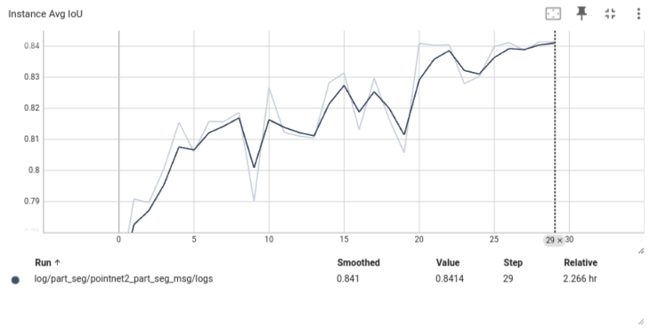

# Point Cloud Segmentation

## Team information

Team name: Balla Krisztián (solo ha lehet) --> or something  like this (this name choice wasn't the greatest idea)  
Team members: Balla Krisztián (RZWVC0)

## Project description

The goal of this project is to delve into point cloud segmentation using Graph Neural Networks (GNNs). You have to work with the ShapeNet dataset, which contains multiple object categories (from airplanes to wine bottles). By choosing this project, you'll gain expertise in deep learning and spatial data analysis.

## Dataset

The ShapeNetPart dataset will be used, which consists of over 17000 point clouds with both manual and automatic part annotations.  
Its available on ShapeNet: https://shapenet.org/download/shapenetsem   
and on kaggle: https://www.kaggle.com/datasets/mitkir/shapenet/data.  
The related article can be found here: https://web.stanford.edu/~ericyi/papers/part_annotation_16_small.pdf.

Please note that the dataset will be automatically downloaded during the docker build phase

## Files and folder structure

For the development phase of my solution a docker-based visual studio code approach is taken. To separate the development environment from my own personal environment, a visual studio code server is attached to the running container so I can write my code in the vscode IDE inside the container (where all the necessary packages are installed):  
1. Download the 'Dev Containers' and 'Docker' vscode extensions.  
2. On the 'Docker' panel (left sidebar) right click on the running container and choose 'attach visual studio code'

Folder/Files and their purpose:  
1. /misc: contains the requirements.txt file, the .params.example file, a .vscode folder (this is just my personal preference) and a .devcontainer folder which includes the neccessary information to install a vscode server and vscode extensions during the docker build.  
2. /src: the main folder, where the actual code goes, it is attached as a volume to the image so no modifications will be lost.  
3. The .gitignore and .dockerignore files are here to (1) act as as safeguard for uploading large or private files to git and (2) to exlude certain files and folders from the docker build context (to make it faster and require less space). 
4. The Dockerfile, build_docker.sh and run_docker.sh are there for the containerization  

Note: For the deployment (finished project), a separate branch will be created with a much more straighforward use

## Building and running the project

### Option 1: without the vscode IDE (recommended approach)

Clone the repository 
```bash
git clone https://github.com/ballakrisz/PointCloudSegmentation.git && \
cd PointCloudSegmentation
```

Make a copy of the misc/.params.example file and name it .params and fill it out according to your file paths, make sure the ***use_vscode='false'***
```bash
cp misc/.params.example misc/.params
```

Build the docker image
```bash
./build_docker.sh
```

Run the image with the following blueprint
```bash
./run_docker_no_vscode.sh ['train|test'] [batch_size] [use_pretrained]
```
#### IMPORTANT
If at any point you cancel the script execution with ctrl+c, don't forget to stop the container by running
```bash
docker stop point_cloud_segmentation 
```

#### Testing
To visualize the trained networks predictions run the following:  
(You can go to the next image by pressing the right arrow on your keyboard, and exit by pressing the escape key)
```bash
./run_docker_no_vscode.sh test
```
To evaluate the model on the whole test dataset run the following where [batch_size] should be a number other than 1 eg.:
```bash
./run_docker_no_vscode.sh test 32
```

#### Training
To train the network run the following command, where [batch_size] should be as big as your PC can handle (or what you prefer), the [use_pretrained] should be either 'true' or 'false'. Example with batch size of 32 and starting from scratch:
```bash
./run_docker_no_vscode.sh train 32 false
```
After this, you can inspect the training in Tensorboard by opening the following url in your browser:   
http://localhost:6006/
### Option 2: using vscode (only recommended if you want to develop the code)

Clone the repository 
```bash
git clone https://github.com/ballakrisz/PointCloudSegmentation.git && \
cd PointCloudSegmentation
```

Make a copy of the misc/.params.example file and name it .params and fill it out according to your file paths, make sure the ***use_vscode='true'***
```bash
cp misc/.params.example misc/.params
```

Build the docker image
```bash
./build_docker.sh
```

Run the image
```bash
./run_docker.sh
```

Attach a vscdoe server to the running container according to the top of the 'Files and folder structure' section and inside the container run  
#### Testing 
```bash
python3 /home/appuser/src/seg_models/Pointnet_Pointnet2_pytorch/test_partseg.py
```

#### Training
```bash
python3 /home/appuser/src/seg_models/Pointnet_Pointnet2_pytorch/train_partseg.py
```
## Baseline model
My baseline model of choice is the PointNet++ architecture because my project focuses on the recent uprising of transformer-based approaches, therefore in the last milestone I will incrementally develop a transformer-based part segmentator with hopes of significantly outpreforming the baseline PointNet++ model.  
The important metrics during training were as follow:  





The evaluation on the dest dataset resulted in the following values:  
<div align="center">

<div style="display: flex; justify-content: space-around;">

<table style="margin-right: 20px;">
    <thead>
        <tr>
            <th>Class</th>
            <th>mIoU</th>
        </tr>
    </thead>
    <tbody>
        <tr>
            <td>Airplane</td>
            <td>0.821437</td>
        </tr>
        <tr>
            <td>Bag</td>
            <td>0.735315</td>
        </tr>
        <tr>
            <td>Cap</td>
            <td>0.841750</td>
        </tr>
        <tr>
            <td>Car</td>
            <td>0.737776</td>
        </tr>
        <tr>
            <td>Chair</td>
            <td>0.905016</td>
        </tr>
        <tr>
            <td>Earphone</td>
            <td>0.714715</td>
        </tr>
        <tr>
            <td>Guitar</td>
            <td>0.904174</td>
        </tr>
        <tr>
            <td>Knife</td>
            <td>0.877231</td>
        </tr>
        <tr>
            <td>Lamp</td>
            <td>0.842915</td>
        </tr>
        <tr>
            <td>Laptop</td>
            <td>0.946049</td>
        </tr>
        <tr>
            <td>Motorbike</td>
            <td>0.595754</td>
        </tr>
        <tr>
            <td>Mug</td>
            <td>0.948060</td>
        </tr>
        <tr>
            <td>Pistol</td>
            <td>0.798120</td>
        </tr>
        <tr>
            <td>Rocket</td>
            <td>0.575504</td>
        </tr>
        <tr>
            <td>Skateboard</td>
            <td>0.751842</td>
        </tr>
        <tr>
            <td>Table</td>
            <td>0.820963</td>
        </tr>
    </tbody>
</table>

<table>
    <thead>
        <tr>
            <th>Metric</th>
            <th>Value</th>
        </tr>
    </thead>
    <tbody>
        <tr>
            <td>Accuracy</td>
            <td>0.93935</td>
        </tr>
        <tr>
            <td>Class avg accuracy</td>
            <td>0.83077</td>
        </tr>
        <tr>
            <td>Class avg mIoU</td>
            <td>0.80104</td>
        </tr>
        <tr>
            <td>Instance avg mIoU</td>
            <td>0.84371</td>
        </tr>
    </tbody>
</table>

</div>

</div>

## Related works

| Model       | GitHub                                             | Article                                                |
|-------------|----------------------------------------------------|--------------------------------------------------------|
| PointNet++:   | [GitHub](https://github.com/charlesq34/pointnet2)   | [Article](https://arxiv.org/abs/1706.02413)            |
| SPoTr       | [GitHub](https://github.com/mlvlab/spotr)           | [Article](https://openaccess.thecvf.com//content/CVPR2023/papers/Park_Self-Positioning_Point-Based_Transformer_for_Point_Cloud_Understanding_CVPR_2023_paper.pdf) |
| PointNeXt   | [GitHub](https://github.com/guochengqian/pointnext) | [Article](https://arxiv.org/pdf/2206.04670v2)          |

